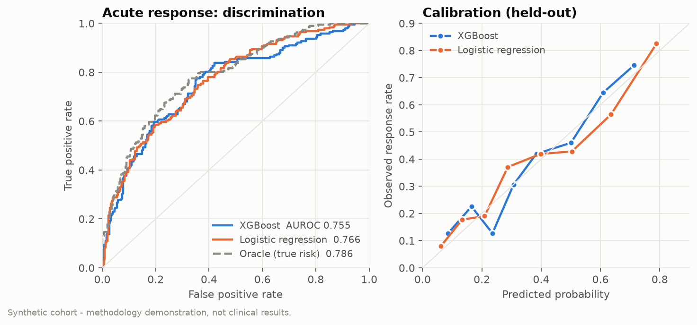
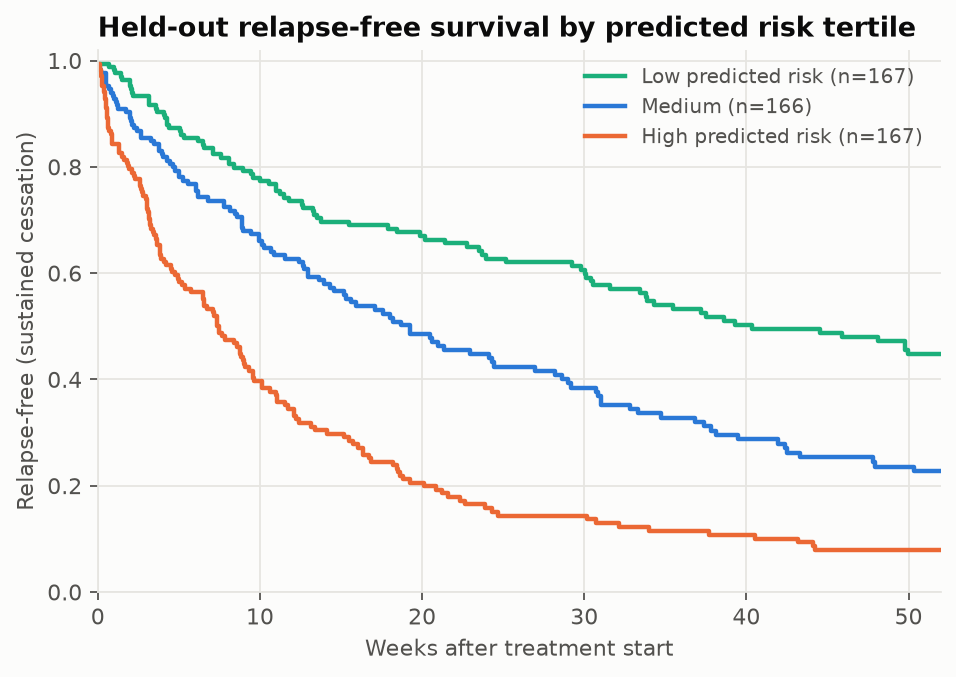
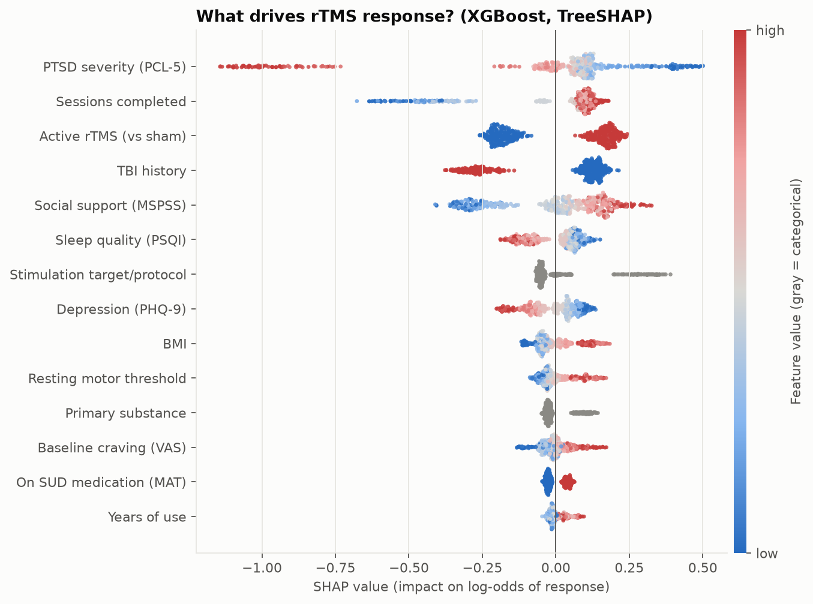
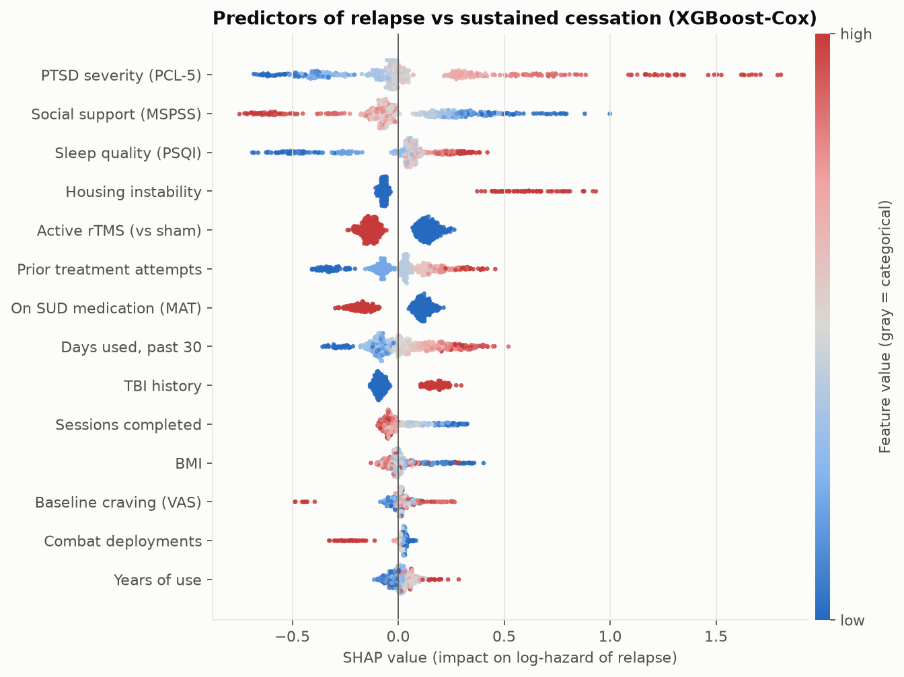
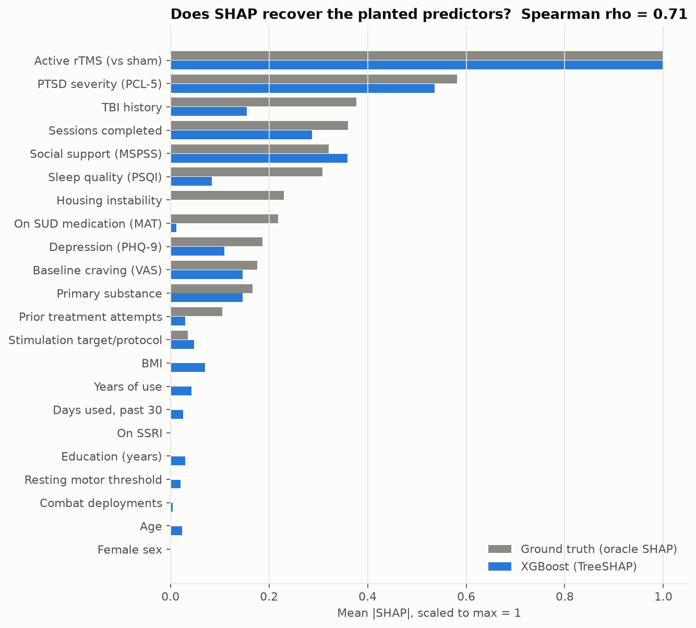
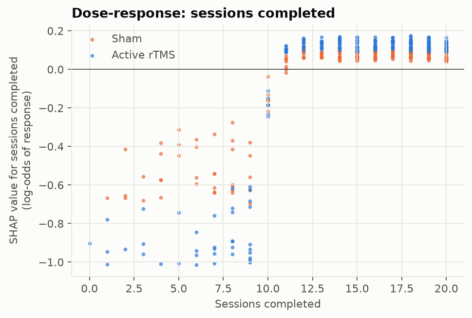
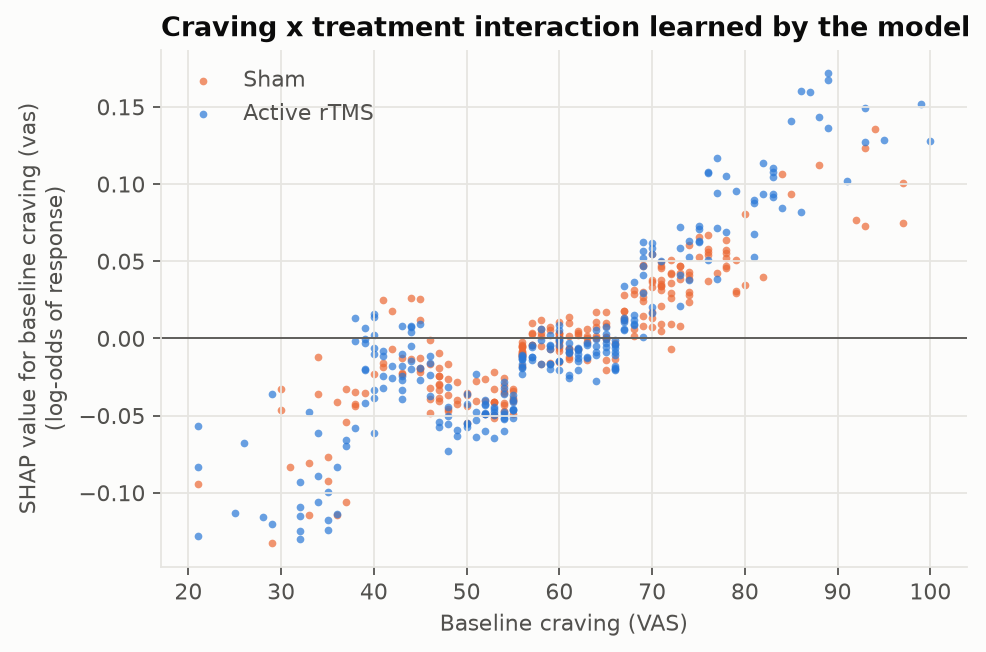
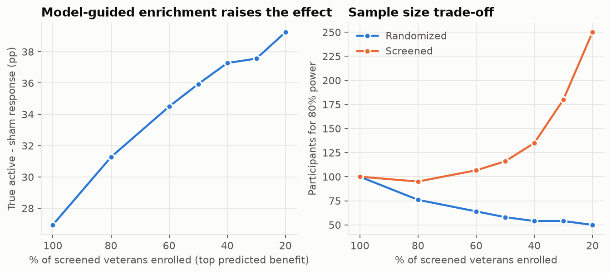
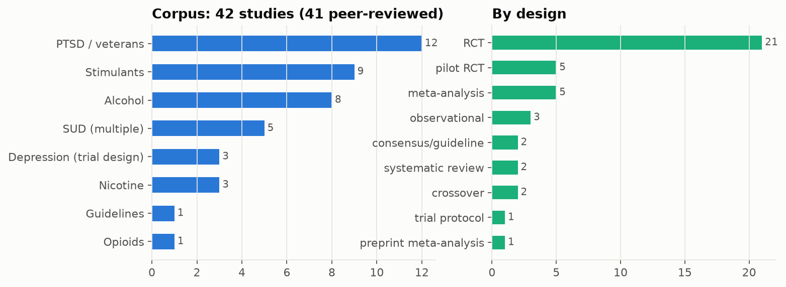

# Noninvasive Neuromodulation for Addiction

**Predicting who responds to rTMS, and who stays abstinent, in veterans with substance use disorders and comorbid PTSD. Plus a citation-grounded research assistant over the rTMS literature.**

[](https://github.com/jacobc1327/neuromodulation/actions/workflows/ci.yml)


The project has two parts:

| | What it does | Stack |
|---|---|---|
| **1. ML pipeline** | Models acute rTMS response and 52-week relapse risk, uses SHAP to find the clinical predictors of cessation, and turns the model into a trial-enrichment design | XGBoost, scikit-survival, SHAP |
| **2. Research RAG** | Answers clinical questions, generates hypotheses and drafts study designs from **42 rTMS studies** (41 peer-reviewed), with every claim citation-checked | LangChain, FAISS, BM25, Claude (optional) |

Built in the context of a Duke Bass Connections project on noninvasive brain stimulation for addiction.

> [!IMPORTANT]
> **The patient data is synthetic.** No real patient records are used anywhere in this repo. The ML pipeline runs on a simulated, literature-informed veteran cohort (see [docs/synthetic_cohort.md](docs/synthetic_cohort.md)). The numbers below show the *methodology*; they are **not clinical findings**. The literature corpus, by contrast, is made of **real, citable studies** with DOIs.

---

## Quick start

```bash
git clone https://github.com/jacobc1327/neuromodulation && cd neuromodulation
pip install -e ".[dev]"            # add ".[llm]" for Claude-powered generation

neuromod ml                         # simulate cohort -> train -> SHAP -> figures (about 1 min)
neuromod ask "Does rTMS reduce craving in alcohol use disorder?"
neuromod hypotheses "rTMS for veterans with PTSD and substance use disorder"
neuromod design "rTMS trial for veterans with alcohol use disorder and comorbid PTSD"
neuromod rag-eval                   # retrieval + grounding benchmark
pytest -q                           # 18 tests
```

Everything runs **offline with no API key**. If `ANTHROPIC_API_KEY` is set and `neuromod[llm]` is installed, the RAG switches from extractive to abstractive generation with Claude. Every answer still goes through the same citation checker.

---

## Part 1: rTMS response and relapse modeling

### Pipeline

```
synthetic veteran cohort (n=2,000, 1:1 active vs sham, 52-wk follow-up)
 ├─ Acute response      XGBoost classifier · randomized hyper-parameter search · 5-fold CV
 │                      vs logistic regression vs the oracle (true) risk
 ├─ Relapse / cessation scikit-survival CoxPH · Random Survival Forest · Gradient-Boosted Cox
 │                      + XGBoost survival:cox with a Breslow baseline hazard
 ├─ Explanation         TreeSHAP, one-hot columns grouped back to clinical features,
 │                      checked against oracle SHAP of the true generating function
 └─ Trial design        T-learner CATE → enrich enrollment → sample size for 80% power
```

### Results on the held-out 25% (synthetic cohort, seed 7)

**Acute response** (at least 50% craving reduction):

| Model | AUROC (95% CI) | Brier | ECE |
|---|---|---|---|
| **XGBoost** | **0.711** (0.663–0.756) | 0.182 | 0.035 |
| Logistic regression | 0.684 (0.636–0.731) | 0.190 | 0.059 |
| *Oracle: true risk* | *0.715* | | |

Response is noisy, so even the true risk only reaches an AUROC of 0.715. XGBoost recovers **98% of the achievable discrimination** above chance. It beats logistic regression because the planted biology is non-linear: a saturating dose-response, a PTSD-severity threshold and a TBI × treatment interaction.

<p align="center"></p>

**Relapse over 52 weeks** (68% event rate):

| Model | Harrell C | Uno C | mean td-AUC | Integrated Brier |
|---|---|---|---|---|
| **CoxPH** (scikit-survival) | **0.678** | **0.677** | **0.743** | **0.187** |
| Gradient-Boosted Cox (scikit-survival) | 0.668 | 0.669 | 0.729 | 0.191 |
| XGBoost Cox | 0.668 | 0.669 | 0.730 | 0.193 |
| Random Survival Forest | 0.663 | 0.663 | 0.722 | 0.197 |

The relapse hazard is close to log-linear, so a regularized Cox model stays the strongest choice and the boosted models match it. The report keeps that result instead of tuning it away.

<p align="center"></p>

### SHAP: clinical predictors of response and cessation

<p align="center"></p>

<p align="center"></p>

**Does SHAP find the right predictors?** The cohort is simulated, so we can compute SHAP values for the *true* response function and compare them with the model's:

* Spearman ρ between model and oracle importances is **0.73**, and 6 of the top 8 features overlap.
* The six planted noise features (BMI, motor threshold, education, SSRI use, deployments, sex) rank 9th–22nd.
* SHAP dependence plots recover the planted **dose-response** (a sharp threshold around 10–12 sessions) and the **craving × treatment** interaction.

<p align="center">
<br>


</p>

### From prediction to study design

A T-learner (one XGBoost per arm) estimates each veteran's individual benefit from active rTMS. Its estimates correlate with the true effect at r = 0.42. Enrolling only the top 50% of predicted responders raises the true active-minus-sham effect from 8.4 to 13.0 percentage points. That cuts the **randomized sample needed for 80% power from 902 to 408 (55% fewer)**. Perfect (oracle) ranking would need 212. The right panel shows the price: more veterans must be screened.

<p align="center"></p>

All numbers are written to [`reports/metrics.json`](reports/metrics.json) on each run.

---

## Part 2: citation-grounded RAG over the rTMS literature

### Corpus

[**42 real studies**](data/corpus/REFERENCES.md) covering:

* PTSD and veterans (12 studies), including VA cooperative and national-program studies
* alcohol (8), stimulants (9), nicotine (3) and opioids (1)
* five cross-substance meta-analyses, including one preprint that is labeled as such
* trial-design landmarks: THREE-D, SNT/SAINT and VA CSP #556
* consensus guidelines

Every record carries a DOI (and a PMID where it could be confirmed), plus structured fields (design, n, target, protocol). The records were checked against publisher, index or repository pages, which are listed per record in `verification_sources`. [`scripts/fetch_pubmed.py`](scripts/fetch_pubmed.py) pulls the official abstracts from NCBI E-utilities when run on a networked machine.

<p align="center"></p>

### Architecture

```
question ──► HybridRetriever (LangChain BaseRetriever)
               ├─ FAISS dense search  (LSA embeddings offline | sentence-transformers | any LangChain Embeddings)
               ├─ BM25 lexical search (domain synonym folding: DLPFC, iTBS, PTSD, AUD…)
               └─ reciprocal-rank fusion → one chunk per study → top-k
         ──► generator
               ├─ Claude via LangChain (ChatPromptTemplate | ChatAnthropic | StrOutputParser)
               └─ offline: extractive evidence synthesis + evidence-table-driven hypotheses / design
         ──► citation checker: every claim needs an [S#] that was retrieved AND lexically supports it
               (--strict drops unsupported sentences)
```

There are three modes: **`ask`** (evidence synthesis), **`hypotheses`** (testable PICO hypotheses) and **`design`** (target, dose and sample-size brief). The `design` mode also reads the ML pipeline's output, so the SHAP predictors become proposed stratification variables and the enrichment analysis feeds the sample-size reasoning. Both are clearly labeled as simulation-derived.

### Evaluation (`neuromod rag-eval`, 24 hand-labeled questions, k = 5)

| Retriever | Recall@5 | MRR@5 | nDCG@5 | Hit@5 |
|---|---|---|---|---|
| BM25 | 0.910 | 0.917 | 0.868 | 0.958 |
| FAISS dense (LSA) | 0.870 | 0.917 | 0.842 | 0.958 |
| **Hybrid (RRF)** | 0.889 | **0.938** | **0.871** | 0.958 |

In offline mode, 100% of the claims in generated answers carry a valid citation that supports them. In the tests, the checker catches a fabricated claim that cites a source which was never retrieved ([`tests/test_rag.py`](tests/test_rag.py)). The eval set is small and written by the author, so treat these numbers as a regression benchmark rather than a general result.

<details>
<summary><b>Example output</b> (offline mode): <code>neuromod ask "Does rTMS reduce craving and relapse in alcohol use disorder?" --k 5</code></summary>

```
## Evidence (5 studies retrieved: 2 RCT, 2 pilot RCT, 1 meta-analysis)
- Hoven et al., 2023 (RCT, n=80): The authors conclude there was no clear evidence that 10 sessions
  of add-on HF-rTMS of the right DLPFC has a lasting positive effect on alcohol use or craving [S1].
- Belgers et al., 2022 (RCT, n=30): Active rTMS showed a significant group-by-time interaction for
  craving and a significant group effect on alcohol use, with the clearest separation from sham
  around three months after treatment [S3].
...
References
[S1] Hoven M, Schluter RS, Schellekens AF, van Holst RJ, Goudriaan AE (2023). Effects of 10 add-on
     HF-rTMS treatment sessions on alcohol use and craving among detoxified inpatients with alcohol
     use disorder ... Addiction. doi:10.1111/add.16025 PMID:35971295
...
_Grounding: 100% of 6 claims supported by their cited source; citation coverage 100%._
```
</details>

---

## Repository layout

```
src/neuromod/
  data/synthetic.py        literature-informed synthetic cohort + ground truth
  models/                  response (XGBoost), survival (sksurv + XGBoost-Cox), HTE / enrichment
  explain/shap_analysis.py grouped TreeSHAP, oracle SHAP, recovery metrics
  rag/                     corpus loader, embeddings, hybrid FAISS/BM25 retriever,
                           grounding checker, LangChain pipeline, evaluation
  viz/plots.py             all figures (colorblind-safe palette)
  pipeline.py, cli.py      end-to-end runner and `neuromod` CLI
data/corpus/               studies.jsonl (42 studies), eval_questions.jsonl, REFERENCES.md
reports/                   metrics.json, rag_eval.json, figures/
docs/synthetic_cohort.md   every simulation assumption and its rationale
scripts/fetch_pubmed.py    enrich the corpus with official PubMed abstracts
tests/                     18 pytest tests (CI on Python 3.10 and 3.12)
```

## Configuration

| Variable | Effect |
|---|---|
| `ANTHROPIC_API_KEY` | enables Claude generation (`pip install -e ".[llm]"`) |
| `NEUROMOD_LLM_MODEL` | Claude model id (default `claude-sonnet-5-5`) |
| `NEUROMOD_OFFLINE=1` | force the extractive backend even when a key is set |
| `NEUROMOD_EMBEDDINGS=hf` | sentence-transformers embeddings in FAISS (`pip install -e ".[embeddings]"`) |
| `NCBI_API_KEY`, `NCBI_EMAIL` | faster PubMed enrichment |

## Limitations

* The ML results come from simulated data. They show that the pipeline can recover planted structure; they say nothing about real veterans. Real use needs an IRB-approved dataset mapped onto the same schema (see the last section of [docs/synthetic_cohort.md](docs/synthetic_cohort.md)).
* Corpus summaries are paraphrases, not official abstracts, until `fetch_pubmed.py` is run. Some PMIDs are missing where they could not be confirmed (DOIs are present for all records).
* The grounding checker measures lexical support, not entailment. A claim can pass while subtly overstating its source. The checker is a guardrail, not a peer reviewer.
* Not medical advice.

## License

MIT
