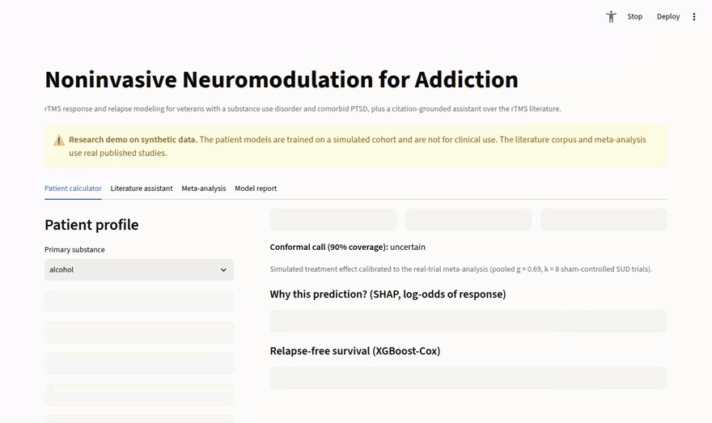
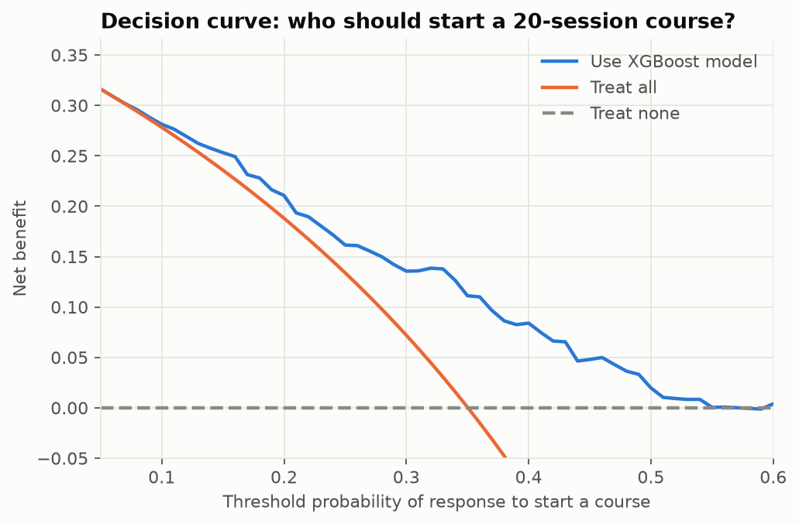
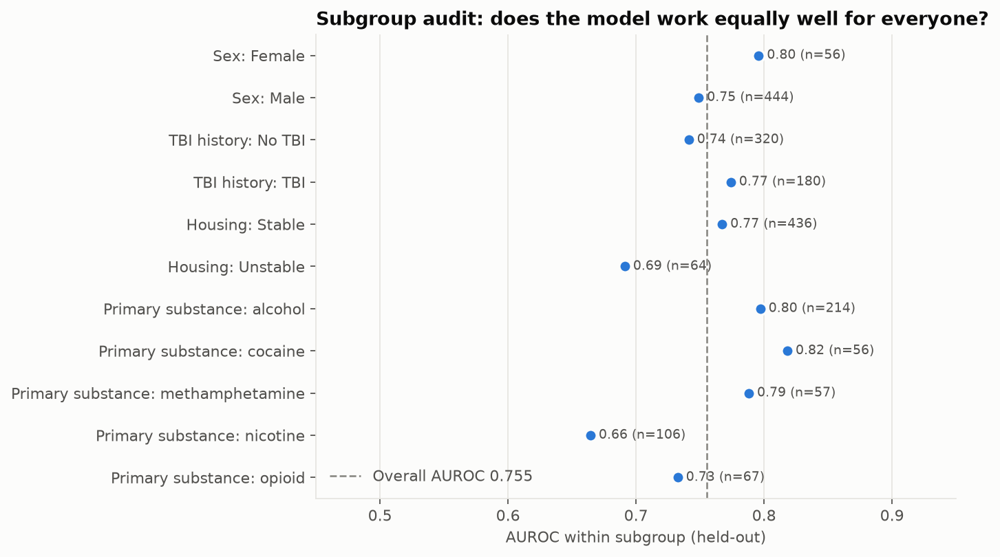
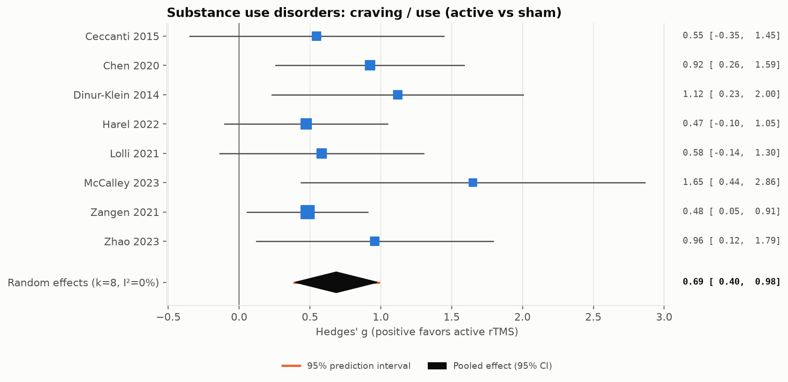
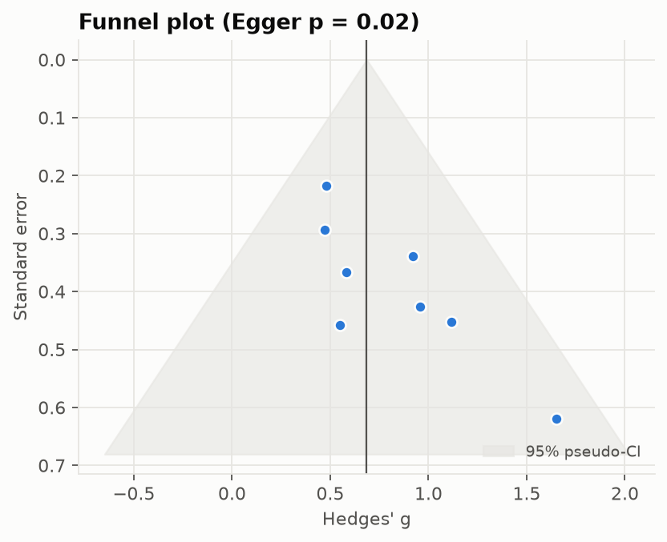
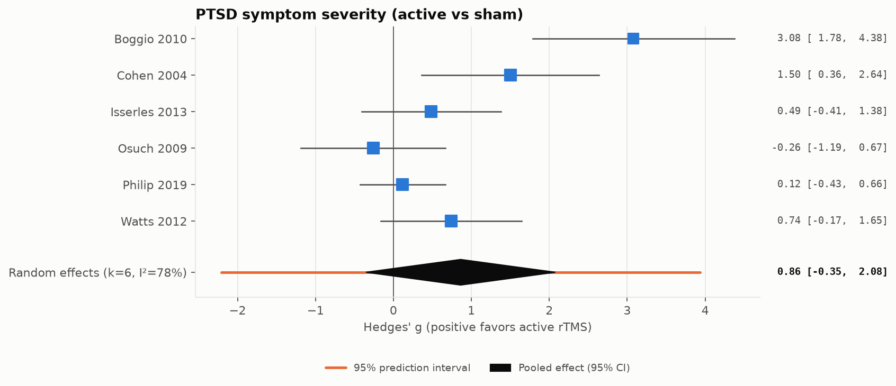
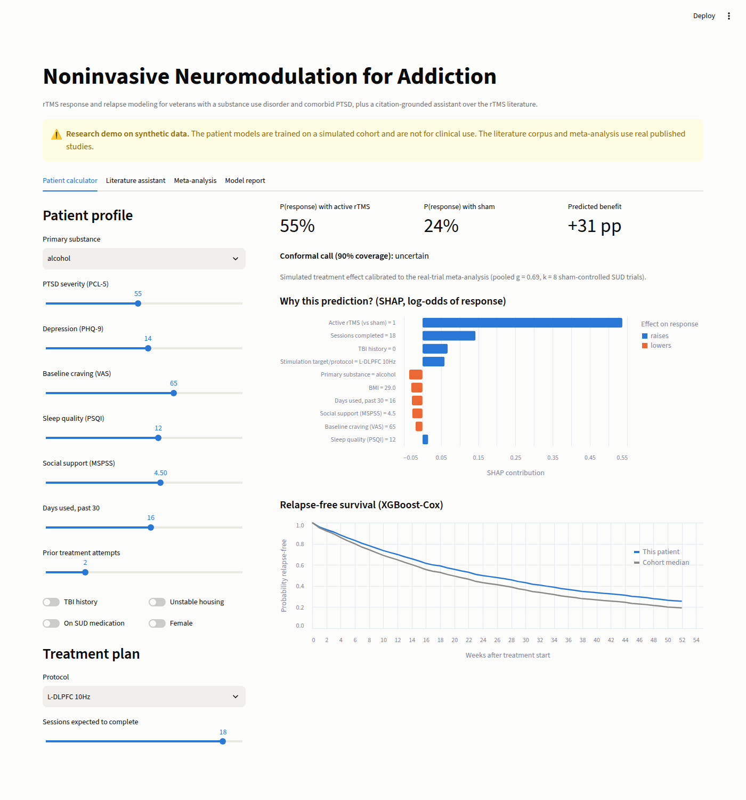

# Noninvasive Neuromodulation for Addiction

**Predicting who responds to rTMS, and who stays abstinent, in veterans with substance use disorders and comorbid PTSD. Plus a citation-grounded research assistant over the rTMS literature.**

[](https://neuromodulation-kn3blkgizmfaabtgjekclr.streamlit.app/)
[](https://github.com/jacobc1327/neuromodulation/actions/workflows/ci.yml)


| | What it does | Stack |
|---|---|---|
| **1. ML pipeline** | Models acute rTMS response and 52-week relapse risk, uses SHAP to find the clinical predictors of cessation, and turns the model into a trial-enrichment design | XGBoost, scikit-survival, SHAP |
| **2. Research RAG** | Answers clinical questions, generates hypotheses and drafts study designs from **42 rTMS studies** (41 peer-reviewed), with every claim citation-checked | LangChain, FAISS, BM25, any LLM (optional) |
| **3. Meta-analysis** | Pools effect sizes extracted from **14 sham-controlled trials** in the corpus. The pooled SUD effect sets the treatment effect in the simulator | REML random effects, Hartung-Knapp |
| **4. Clinical evaluation** | Decision curves, conformal prediction sets and a subgroup fairness audit for the response model | NumPy, scikit-learn |
| **5. Interactive demo** | Patient-level calculator, literature assistant and meta-analysis browser | Streamlit, Altair |

**[Try the live demo](https://neuromodulation-kn3blkgizmfaabtgjekclr.streamlit.app/)**: no install needed.

<p align="center"><a href="https://neuromodulation-kn3blkgizmfaabtgjekclr.streamlit.app/"></a><br>
<sub>A screen recording of the app: dragging PTSD severity, adding TBI and cutting the dose updates the prediction, SHAP and survival curve live; then the literature assistant, meta-analysis and model report. Click to open the live app.</sub></p>

Built in the context of a Duke Bass Connections project on noninvasive brain stimulation for addiction.

> [!IMPORTANT]
> **The patient data is synthetic.** No real patient records are used anywhere in this repo. The ML pipeline runs on a simulated, literature-informed veteran cohort (see [docs/synthetic_cohort.md](docs/synthetic_cohort.md)). The numbers below show the *methodology*; they are **not clinical findings**. The literature corpus, by contrast, is made of **real, citable studies** with DOIs.

---

## Quick start

```bash
git clone https://github.com/jacobc1327/neuromodulation && cd neuromodulation
pip install -e ".[dev]"            # add ".[llm]" for LLM-powered generation

neuromod meta                       # meta-analysis of the real trials (run first: it calibrates `ml`)
neuromod ml                         # simulate cohort -> train -> SHAP -> clinical eval -> figures
neuromod ask "Does rTMS reduce craving in alcohol use disorder?"
neuromod hypotheses "rTMS for veterans with PTSD and substance use disorder"
neuromod design "rTMS trial for veterans with alcohol use disorder and comorbid PTSD"
neuromod rag-eval                   # retrieval + grounding benchmark
pytest -q                           # 32 tests

pip install -e ".[app]" && streamlit run app/streamlit_app.py   # interactive demo
```

Everything runs **offline with no API key**. If `NEUROMOD_LLM_MODEL` is set (any LangChain chat model, e.g. `provider:model-name`) and `neuromod[llm]` plus that provider's package are installed, the RAG switches from extractive to abstractive generation. Every answer still goes through the same citation checker.

---

## Part 1: rTMS response and relapse modeling

### Pipeline

```
real-trial meta-analysis ──► treatment effect (log OR) for the simulator
synthetic veteran cohort (n=2,000, 1:1 active vs sham, 52-wk follow-up)
 ├─ Acute response      XGBoost classifier · randomized hyper-parameter search · 5-fold CV
 │                      vs logistic regression vs the oracle (true) risk
 ├─ Relapse / cessation scikit-survival CoxPH · Random Survival Forest · Gradient-Boosted Cox
 │                      + XGBoost survival:cox with a Breslow baseline hazard
 ├─ Explanation         TreeSHAP, one-hot columns grouped back to clinical features,
 │                      checked against oracle SHAP of the true generating function
 ├─ Clinical evaluation decision curves · split-conformal prediction sets · subgroup audit
 └─ Trial design        T-learner CATE → enrich enrollment → sample size for 80% power
```

### Results on the held-out 25% (synthetic cohort, seed 7)

The treatment effect in the simulator is not a guess. It is set so that the cohort's marginal active-vs-sham log odds ratio equals the **pooled effect from the real-trial meta-analysis** below (g = 0.69, log OR = 1.24; see [Part 3](#part-3-meta-analysis-of-the-sham-controlled-trials)). Response rates come out at 54% on active rTMS and 22% on sham.

**Acute response** (at least 50% craving reduction):

| Model | AUROC (95% CI) | Brier | ECE |
|---|---|---|---|
| XGBoost | 0.755 (0.711–0.796) | 0.192 | 0.044 |
| Logistic regression | 0.766 (0.724–0.806) | 0.188 | 0.046 |
| *Oracle: true risk* | *0.786* | | |

Response is noisy, so even the true risk only reaches an AUROC of 0.786. XGBoost recovers **89% of the achievable discrimination** above chance (cross-validated AUROC 0.777). With a realistic, large treatment effect, the active-vs-sham main effect dominates and a linear model is just as good: the two models are statistically indistinguishable. The pipeline reports that rather than tuning it away, and XGBoost is kept because TreeSHAP still recovers the non-linear structure (a saturating dose-response, a PTSD-severity threshold and a TBI × treatment interaction).

<p align="center"></p>

**Relapse over 52 weeks** (65% event rate):

| Model | Harrell C | Uno C | mean td-AUC | Integrated Brier |
|---|---|---|---|---|
| **Random Survival Forest** | **0.681** | **0.678** | **0.735** | 0.194 |
| CoxPH (scikit-survival) | 0.679 | 0.675 | 0.734 | **0.188** |
| Gradient-Boosted Cox (scikit-survival) | 0.675 | 0.672 | 0.728 | 0.190 |
| XGBoost Cox | 0.665 | 0.662 | 0.718 | 0.195 |

The relapse hazard is close to log-linear, so a regularized Cox model is as good as the ensembles and has the best calibration (lowest integrated Brier).

<p align="center"></p>

### SHAP: clinical predictors of response and cessation

<p align="center"></p>

<p align="center"></p>

The strongest predictors of response after treatment arm are PTSD severity (PCL-5), social support, sessions completed and TBI history. Relapse is driven by PTSD severity, social support, sleep quality and unstable housing.

**Does SHAP find the right predictors?** The cohort is simulated, so we can compute SHAP values for the *true* response function and compare them with the model's:

* Spearman ρ between model and oracle importances is **0.71**, and 5 of the top 8 features overlap.
* Five of the six planted noise features (motor threshold, education, SSRI use, deployments, sex) rank 14th–21st; BMI ranks 10th.
* SHAP dependence plots recover the planted **dose-response** (a sharp threshold around 10–12 sessions) and the **craving × treatment** interaction.

<p align="center">
<br>


</p>

### Clinical evaluation: would you actually use it?

AUROC says whether a model ranks patients well. It does not say whether using it changes decisions for the better, how uncertain each prediction is, or whether it works equally well for everyone. Step 5 of the pipeline checks all three ([`models/clinical_eval.py`](src/neuromod/models/clinical_eval.py)).

**Decision curve analysis** (Vickers & Elkin 2006). The question is whether to start a 20-session course for a veteran in the active arm. Across the clinically plausible threshold range of 15–45%, using the model beats both "treat everyone" and "treat no one" at **87% of thresholds** (mean net benefit 0.343 vs 0.310). Its advantage grows as the threshold rises, which is when a clinic has to ration chair time.

<p align="center"></p>

**Conformal prediction** (split-conformal, 90% target). Half of the held-out set calibrates the model and the other half tests it. Every patient gets a set of plausible outcomes with a coverage guarantee, which turns into one of three calls: *likely responder*, *likely non-responder* or *uncertain*. Plain conformal sets reach 89.4% coverage, but only 77% among true responders. Class-conditional (Mondrian) conformal fixes that imbalance (82% for responders, 89% for non-responders) at the cost of slightly larger sets. About 45% of patients get an honest "uncertain".

**Subgroup audit.** Held-out AUROC, calibration-in-the-large and true/false positive rates for sex, TBI history, housing and primary substance:

<p align="center"></p>

Discrimination is weakest for **nicotine** (AUROC 0.66, n = 106) and **unstable housing** (0.69, n = 64). In both groups the model also over-predicts response (calibration-in-the-large +0.10 and +0.09) and has the highest false positive rates. These are the groups where a real deployment would need recalibration or more data before use.

### From prediction to study design

A T-learner (one XGBoost per arm) estimates each veteran's individual benefit from active rTMS. Its estimates correlate with the true effect at r = 0.63. Enrolling only the top 50% of predicted responders raises the true active-minus-sham effect from 27 to 36 percentage points. That cuts the **randomized sample needed for 80% power from 100 to 58 (42% fewer)**. Perfect (oracle) ranking would need 46. The right panel shows the price: more veterans must be screened.

<p align="center"></p>

All numbers are written to [`reports/metrics.json`](reports/metrics.json) on each run.

---

## Part 2: citation-grounded RAG over the rTMS literature

### Corpus

[**42 real studies**](data/corpus/REFERENCES.md) covering:

* PTSD and veterans (12 studies), including VA cooperative and national-program studies
* alcohol (8), stimulants (9), nicotine (3) and opioids (1)
* five cross-substance meta-analyses, including one preprint that is labeled as such
* trial-design landmarks: THREE-D, SNT/SAINT and VA CSP #556
* consensus guidelines

Every record carries a DOI (and a PMID where it could be confirmed), plus structured fields (design, n, target, protocol). The records were checked against publisher, index or repository pages, which are listed per record in `verification_sources`. [`scripts/fetch_pubmed.py`](scripts/fetch_pubmed.py) pulls the official abstracts from NCBI E-utilities when run on a networked machine.

<p align="center"></p>

### Architecture

```
question ──► HybridRetriever (LangChain BaseRetriever)
               ├─ FAISS dense search  (LSA embeddings offline | sentence-transformers | any LangChain Embeddings)
               ├─ BM25 lexical search (domain synonym folding: DLPFC, iTBS, PTSD, AUD…)
               └─ reciprocal-rank fusion → one chunk per study → top-k
         ──► generator
               ├─ any LLM via LangChain (ChatPromptTemplate | init_chat_model | StrOutputParser)
               └─ offline: extractive evidence synthesis + evidence-table-driven hypotheses / design
         ──► citation checker: every claim needs an [S#] that was retrieved AND lexically supports it
               (--strict drops unsupported sentences)
```

There are three modes: **`ask`** (evidence synthesis), **`hypotheses`** (testable PICO hypotheses) and **`design`** (target, dose and sample-size brief). The `design` mode also reads the ML pipeline's output, so the SHAP predictors become proposed stratification variables and the enrichment analysis feeds the sample-size reasoning. Both are clearly labeled as simulation-derived.

### Evaluation (`neuromod rag-eval`, 24 hand-labeled questions, k = 5)

| Retriever | Recall@5 | MRR@5 | nDCG@5 | Hit@5 |
|---|---|---|---|---|
| BM25 | 0.910 | 0.917 | 0.868 | 0.958 |
| FAISS dense (LSA) | 0.870 | 0.917 | 0.842 | 0.958 |
| **Hybrid (RRF)** | 0.889 | **0.938** | **0.871** | 0.958 |

In offline mode, 100% of the claims in generated answers carry a valid citation that supports them. In the tests, the checker catches a fabricated claim that cites a source which was never retrieved ([`tests/test_rag.py`](tests/test_rag.py)). The eval set is small and written by the author, so treat these numbers as a regression benchmark rather than a general result.

<details>
<summary><b>Example output</b> (offline mode): <code>neuromod ask "Does rTMS reduce craving and relapse in alcohol use disorder?" --k 5</code></summary>

```
## Evidence (5 studies retrieved: 2 RCT, 2 pilot RCT, 1 meta-analysis)
- Hoven et al., 2023 (RCT, n=80): The authors conclude there was no clear evidence that 10 sessions
  of add-on HF-rTMS of the right DLPFC has a lasting positive effect on alcohol use or craving [S1].
- Belgers et al., 2022 (RCT, n=30): Active rTMS showed a significant group-by-time interaction for
  craving and a significant group effect on alcohol use, with the clearest separation from sham
  around three months after treatment [S3].
...
References
[S1] Hoven M, Schluter RS, Schellekens AF, van Holst RJ, Goudriaan AE (2023). Effects of 10 add-on
     HF-rTMS treatment sessions on alcohol use and craving among detoxified inpatients with alcohol
     use disorder ... Addiction. doi:10.1111/add.16025 PMID:35971295
...
_Grounding: 100% of 6 claims supported by their cited source; citation coverage 100%._
```
</details>

---

## Part 3: meta-analysis of the sham-controlled trials

`neuromod meta` pools the sham-controlled trials in the corpus that report enough data to compute an effect size. Every number in [`data/meta/`](data/meta) carries a verbatim quote from the paper and the URL it came from, so each row can be audited. Trials that could not be extracted are listed with the reason (for example, not sham-controlled, or results reported only as a figure).

* **Effect sizes** ([`meta/effects.py`](src/neuromod/meta/effects.py)): Hedges' g from means and SDs, t, F, Cohen's d or partial η², and from event counts via the log odds ratio (Chinn 2000). Positive g favors active rTMS.
* **Pooling** ([`meta/pooling.py`](src/neuromod/meta/pooling.py)): random effects with REML τ² and Hartung-Knapp confidence intervals (the safer choice with few studies), 95% prediction intervals, Egger's test, leave-one-out sensitivity and a meta-regression on protocol moderators (deep TMS, medial target, theta burst). Validated against textbook examples in [`tests/test_meta.py`](tests/test_meta.py).

| Analysis | k | Participants | Hedges' g (95% CI) | 95% PI | I² | Egger p |
|---|---|---|---|---|---|---|
| **SUD: craving or use** | 8 | 520 | **0.69 (0.40–0.98)**, p < 0.001 | 0.39–0.99 | 0% | 0.02 |
| PTSD symptom severity | 6 | 142 | 0.86 (−0.35–2.08), p = 0.13 | −2.21–3.94 | 78% | 0.10 |

<p align="center"></p>

The SUD result is a moderate, consistent benefit: no study changes the pooled g by more than 0.09 when it is left out (range 0.65–0.78). But the small trials report the largest effects and Egger's test is significant, so small-study bias is likely and the true effect is probably smaller. The meta-regression finds no protocol moderator that explains the effect (theta burst +0.51, p = 0.28), as expected with 8 studies.

<p align="center"></p>

The PTSD trials are highly heterogeneous, and the pooled effect is not significant once the Hartung-Knapp correction is applied. Leaving out the largest effect (Boggio 2010) drops the pooled g to 0.42.

<p align="center"></p>

These are exploratory pools over a curated corpus, not a systematic review: there was no registered protocol or exhaustive search, and outcomes (craving, use, abstinence) are mixed within the SUD pool. Their job here is to ground the simulator in real effect sizes.

---

## Part 4: interactive demo

Live at **[neuromodulation-kn3blkgizmfaabtgjekclr.streamlit.app](https://neuromodulation-kn3blkgizmfaabtgjekclr.streamlit.app/)**. To run it locally:

```bash
pip install -e ".[app]"
streamlit run app/streamlit_app.py
```

<p align="center"></p>

The app has four tabs: a **patient calculator** (response probability under each arm, the conformal call, a SHAP breakdown and a relapse-free survival curve), the **literature assistant**, the **meta-analysis** browser and the **model report**. It runs offline with no API key.

**Deploying to Streamlit Community Cloud:** sign in at [share.streamlit.io](https://share.streamlit.io) with GitHub, choose *Create app*, pick this repo, branch `main` and main file `app/streamlit_app.py`. [`requirements.txt`](requirements.txt) installs the package. Models train once at start-up (a few seconds) and are cached.

---

## Repository layout

```
src/neuromod/
  data/synthetic.py        literature-informed synthetic cohort + ground truth
  models/                  response (XGBoost), survival (sksurv + XGBoost-Cox), HTE / enrichment,
                           clinical evaluation (decision curves, conformal, subgroup audit)
  meta/                    effect sizes, random-effects pooling, meta-regression, runner
  explain/shap_analysis.py grouped TreeSHAP, oracle SHAP, recovery metrics
  rag/                     corpus loader, embeddings, hybrid FAISS/BM25 retriever,
                           grounding checker, LangChain pipeline, evaluation
  viz/plots.py             all figures (colorblind-safe palette)
  demo.py                  model bundle behind the app
  pipeline.py, cli.py      end-to-end runner and `neuromod` CLI
app/streamlit_app.py       interactive demo
data/meta/                 extracted effect sizes with quotes and sources
data/corpus/               studies.jsonl (42 studies), eval_questions.jsonl, REFERENCES.md
reports/                   metrics.json, rag_eval.json, meta/, figures/
docs/synthetic_cohort.md   every simulation assumption and its rationale
scripts/fetch_pubmed.py    enrich the corpus with official PubMed abstracts
tests/                     32 pytest tests (CI on Python 3.11 and 3.12)
```

## Configuration

| Variable | Effect |
|---|---|
| `NEUROMOD_LLM_MODEL` | enables LLM generation; any `init_chat_model` id such as `provider:model-name` (`pip install -e ".[llm]"` plus the provider package and its API key) |
| `NEUROMOD_OFFLINE=1` | force the extractive backend even when a key is set |
| `NEUROMOD_EMBEDDINGS=hf` | sentence-transformers embeddings in FAISS (`pip install -e ".[embeddings]"`) |
| `NCBI_API_KEY`, `NCBI_EMAIL` | faster PubMed enrichment |

## Limitations

* The ML results come from simulated data. They show that the pipeline can recover planted structure; they say nothing about real veterans. Real use needs an IRB-approved dataset mapped onto the same schema (see the last section of [docs/synthetic_cohort.md](docs/synthetic_cohort.md)).
* The meta-analysis is exploratory (see Part 3). One crossover trial (Osuch 2009) is analysed as if it were parallel, which is conservative. Four PTSD effect sizes come from a published meta-analysis (Trevizol 2016) rather than the original papers.
* Corpus summaries are paraphrases, not official abstracts, until `fetch_pubmed.py` is run. Some PMIDs are missing where they could not be confirmed (DOIs are present for all records).
* The grounding checker measures lexical support, not entailment. A claim can pass while subtly overstating its source. The checker is a guardrail, not a peer reviewer.
* Not medical advice.

## License

MIT
